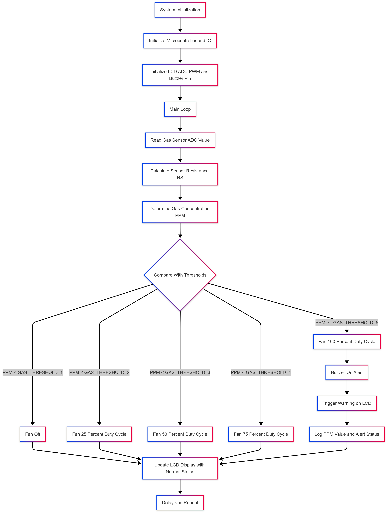

    

<h1 align="center">Smart Gas Leak Detection and Ventilation Control System</h1>

  

  
<h2>📚 Table of Contents (Click to Expand)</h2>

- [📌 Project Overview](#-project-overview)
- [👥 Project Members](#-project-members)
- [🚀 Features](#-features)
- [⚙️ How It Works](#️-how-it-works)
  - [🔹 **Gas Leak Detection**](#-gas-leak-detection)
  - [🔹 **LCD Display \& Alerts**](#-lcd-display--alerts)
- [🛠️ Components Used](#️-components-used)
  - [**🔍 Sensors \& Inputs**](#-sensors--inputs)
  - [**⚡ Outputs \& Actuators**](#-outputs--actuators)
- [🖥️ Installation](#️-installation)
- [🔌 Hardware Connections for Gas Leak Detection System](#-hardware-connections-for-gas-leak-detection-system)
- [📈 System Flowchart](#-system-flowchart)
- [📜 License](#-license)
- [📩 Contact](#-contact)

---

## 📌 Project Overview

The **Smart Gas Leak Detection and Ventilation Control System** is a safety automation project that identifies hazardous gas leaks (e.g., LPG, Methane) and promptly takes action to avoid danger. It is ideally suited for **domestic kitchens, hotels, small industries, and laboratories**.

Using an **MQ-6 gas sensor**, the system continuously monitors air quality. When gas concentrations surpass a safety threshold, it automatically activates a **PWM-controlled exhaust fan** and triggers a **buzzer alarm**, while displaying live readings on an **LCD display**.

It is developed using a **PIC16F877A microcontroller**, programmed with MPLAB IDE and the XC8 compiler.

---

## 👥 Project Members

- **Anmol Govindarajapuram Krishnan** – [LinkedIn](https://www.linkedin.com/in/anmolkrish/)
- **Karthik K** – [LinkedIn](https://www.linkedin.com/in/karthik-krishnamurthi)

---

## 🚀 Features

- ✅ Real-time detection of gas leaks (LPG, Butane, Methane, Smoke)
- 📟 LCD display for live concentration levels
- 🔔 Buzzer alert on threshold breach
- 🌬️ Automatic fan-based ventilation control
- 🔄 Continuous air quality monitoring
- 🧠 Embedded system logic for automation and safety

---

## ⚙️ How It Works

### 🔹 **Gas Leak Detection**

- The **MQ-6 sensor** reads gas concentration in parts per million (PPM).
- The analog signal is processed by the **PIC microcontroller**, comparing it with a safe threshold (predefined in code).
- When the threshold is exceeded, the microcontroller:
  - Activates the **exhaust fan** via a **MOSFET-based driver circuit**
  - Triggers a **buzzer alarm**

### 🔹 **LCD Display & Alerts**

- The **16x2 LCD display** continuously shows the current gas concentration levels.
- A buzzer provides an audio warning signal to alert nearby personnel of a gas leak.

---

## 🛠️ Components Used

### **🔍 Sensors & Inputs**
- **MQ-6 Gas Sensor** – Detects gases like LPG, Butane, Methane, and smoke.
- **Potentiometer** – Used for analog calibration and LCD contrast control.

### **⚡ Outputs & Actuators**
- **PWM-controlled Exhaust Fan** – Enhances air circulation to reduce gas concentration.
- **16x2 LCD Module** – Real-time gas concentration display.
- **Buzzer Module** – Triggers an alert when gas exceeds safe levels.
- **MOSFET Driver Circuit** – Controls the power to the exhaust fan.

---

## 🖥️ Installation

1. **Download & install** MPLAB IDE → [MPLAB IDE v5.10+](https://www.microchip.com/en-us/tools-resources/archives/mplab-ecosystem)
2. Install the **XC8 Compiler** → [XC8 v2.50+](https://www.microchip.com/en-us/tools-resources/develop/mplab-xc-compilers#tabs)
3. Load the `.c` source code into MPLAB and compile it for **PIC16F877A**
4. Flash the compiled HEX file onto the microcontroller using a PIC burner (e.g., PICKIT 3)

---

## 🔌 Hardware Connections for Gas Leak Detection System

  

---

## 📈 System Flowchart

  

---

## 📜 License

This project is licensed under the **MIT License**. See the [LICENSE](LICENSE) file for more details.  

---

## 📩 Contact

For inquiries, suggestions, or collaborations, feel free to reach out:

- **Anmol Govindarajapuram Krishnan** – [LinkedIn](https://www.linkedin.com/in/anmolkrish/)
- **Karthik K** – [LinkedIn](https://www.linkedin.com/in/karthik-krishnamurthi)

