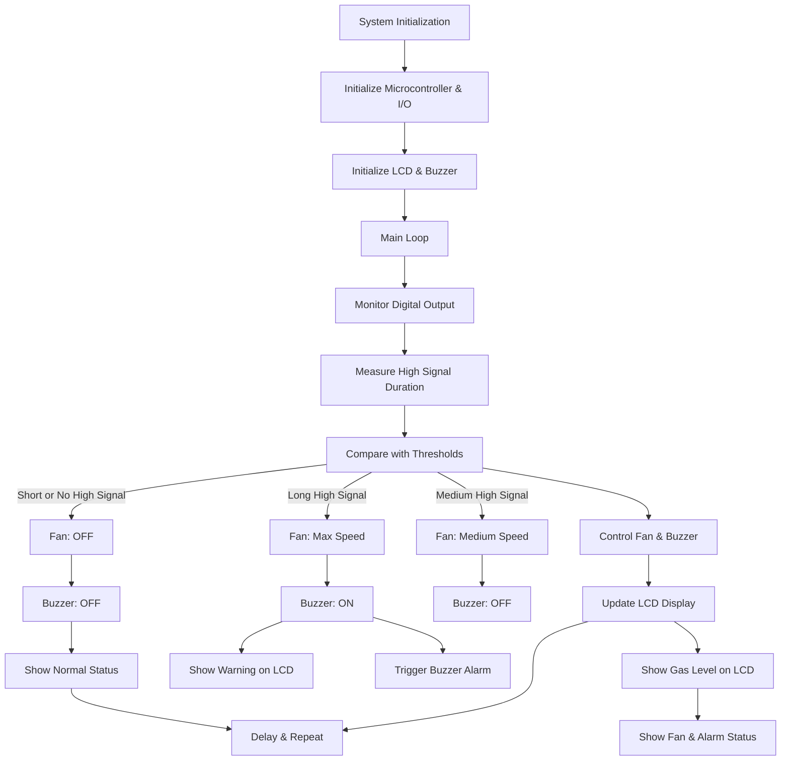

<h1 align="center">Smart Gas Leak Detection and Ventilation Control System</h1>

<p align="center">
  
</p>

<details>
  <summary><h2>📚 Table of Contents (Click to Expand)</h2></summary>

- [📌 Project Overview](#-project-overview)
- [👥 Project Members](#-project-members)
- [🚀 Features](#-features)
- [⚙️ How It Works](#️-how-it-works)
  - [🔹 **Gas Leak Detection**](#-gas-leak-detection)
  - [🔹 **LCD Display \& Alerts**](#-lcd-display--alerts)
- [🛠️ Components Used](#️-components-used)
  - [**🔍 Sensors \& Inputs**](#-sensors--inputs)
  - [**⚡ Outputs \& Actuators**](#-outputs--actuators)
- [🖥️ Installation](#️-installation)
- [🔌 Hardware Connections for Gas Leak Detection System](#-hardware-connections-for-gas-leak-detection-system)
    - [1. MQ-6 Gas Sensor](#1-mq-6-gas-sensor)
    - [2. Exhaust Fan (PWM Control)](#2-exhaust-fan-pwm-control)
    - [3. LCD Display](#3-lcd-display)
    - [4. Buzzer Alert](#4-buzzer-alert)
    - [5. Power Supply](#5-power-supply)
  - [🛠️ Jumper Settings Summary](#️-jumper-settings-summary)
- [📈 System Flowchart](#-system-flowchart)
- [🤝 Contributing](#-contributing)
- [📜 License](#-license)
- [📩 Contact](#-contact)

</details>

## 📌 Project Overview  
The **Smart Gas Leak Detection and Ventilation Control System** enhances safety in homes, kitchens, and industrial spaces by detecting gas leaks and triggering an exhaust fan to **prevent hazardous gas accumulation**.  

It utilizes an **MQ-6 gas sensor** to detect leaks and automatically activates an **exhaust fan** when gas levels exceed a threshold, ensuring a **safe environment**.  

---

## 👥 Project Members  
- **Anmol Govindarajapuram Krishnan** – CB.EN.U4EEE23103  
- **Karthik K** – CB.EN.U4EEE23116  

---
## 🚀 Features  
- **Automatic gas leak detection**  
- **Real-time LCD monitoring**  
- **Buzzer alert system**  
- **Exhaust fan activation for safety**  

---

## ⚙️ How It Works  

### 🔹 **Gas Leak Detection**  
- The **MQ-6 gas sensor** continuously monitors the surroundings for **Methane, Butane, LPG, and smoke**.  
- If gas levels exceed a safety threshold, the **exhaust fan is triggered** to remove the gas.  

### 🔹 **LCD Display & Alerts**  
- **Real-time display** of gas concentration.  
- **Buzzer alarm** alerts users when gas leaks are detected.  

---

## 🛠️ Components Used  

### **🔍 Sensors & Inputs**  
- **MQ-6 Gas Sensor** – Detects hazardous gases like **Methane, Butane, LPG, and smoke**.  

### **⚡ Outputs & Actuators**  
- **PWM-controlled Exhaust Fan** – Automatically turns on when gas levels exceed the threshold.  
- **LCD Display** – Shows gas concentration levels.  
- **Buzzer** – Sounds an alert in case of a gas leak.  
- **Motor Driver (MOSFET-based)** – Controls fan motor speed.  

---

## 🖥️ Installation  
- The system is programmed using **MPLAB IDE**,  visit the [MPLAB IDE Download Page](https://www.microchip.com/en-us/tools-resources/archives/mplab-ecosystem). *```(ver >= 5.10)```*.  
- Install the XC8 Compiler [XC8 Compiler Download Page](https://www.microchip.com/en-us/tools-resources/develop/mplab-xc-compilers#tabs) *```(ver >= 2.50)```*.

---

## 🔌 Hardware Connections for Gas Leak Detection System

#### 1. MQ-6 Gas Sensor
- **Digital Output:** Connect the **DOUT** pin of the MQ-6 sensor to **RB0/INT (Pin 33 of PIC16F877A)**.
- **Trigger Logic:** The system measures how long the sensor outputs a **HIGH signal** to determine gas concentration.


#### 2. Exhaust Fan (PWM Control)
- **PWM Output:** Connect the **fan motor driver** to **RC2/CCP1 (Pin 17 of PIC16F877A)**.
- **Activation Logic:** The fan is activated based on the duration of the HIGH signal from the sensor.
- **Jumper Setting:** Short **K6 (PWM Terminal)** to enable PWM output.

#### 3. LCD Display
- **Connection:** Already integrated on the board (**PORTD and PORTC**).
- **Pins Used:**
  - **Data Pins:** RD0-RD7 (Port D, Pins 19-26).
  - **Control Pins:** RC0 (RS), RC1 (RW), RC5 (EN).
- **Adjustment:** Use the onboard contrast knob (**P1**) for visibility.

#### 4. Buzzer Alert
- **Connection:** Buzzer is pre-connected to **RE0 (Pin 8 of PIC16F877A)**.
- **Activation:** **Buzzer triggers** when a gas leak is detected.

#### 5. Power Supply
- **Option 1:** Use the **USB port (K1)** for **5V power**.
- **Option 2:** Use the **screw terminal (K3)** for **7-20V external DC input**.
- **Jumper:** Set **K2** to position **1-2** for USB power or **2-3** for external DC.

### 🛠️ Jumper Settings Summary
| **Component**       | **Jumper** | **Setting**                            |
|--------------------|-----------|--------------------------------------|
| **Gas Sensor (DOUT)** | N/A       | Connect to RB0/INT (Pin 33)        |
| **PWM (Fan)**       | K6        | Short to enable PWM output          |
| **Power Source**    | K2        | **1-2** (USB) or **2-3** (External) |


---

## 📈 System Flowchart

---

## 🤝 Contributing  
- Contribution guidelines will be added soon.  

---

## 📜 License  
- This project is licensed under the **MIT License**. Refer to the [LICENSE](LICENSE) file for more details.  

---

## 📩 Contact  
For inquiries or collaboration, reach out to the project members.  

---